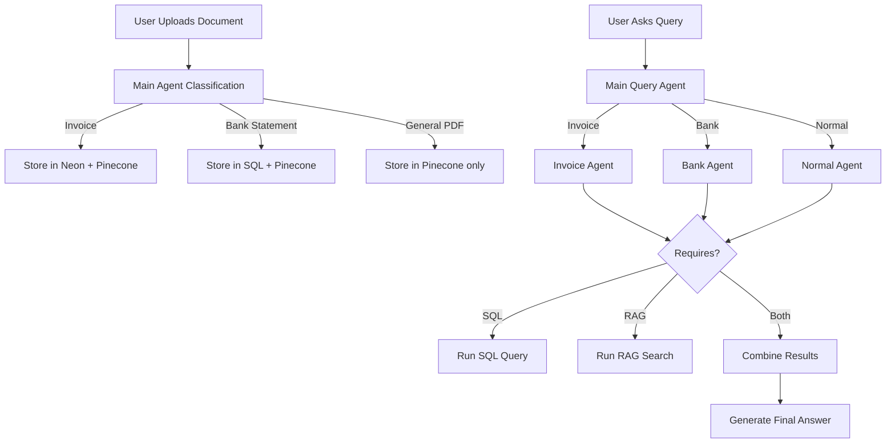

# 🧠 Intelligent Document Understanding System

An advanced AI-powered platform that **analyzes and understands uploaded documents** such as invoices, bank statements, and general PDFs.  
The system intelligently classifies, extracts, and stores structured information, enabling both **semantic and SQL-based querying** — all within a scalable cloud-native architecture.

---

## 🚀 Project Overview

This project automates document analysis using **AI agents, vector search, and RAG (Retrieval-Augmented Generation)**.  
When a user uploads a document (Invoice, Bank Statement, or General PDF):

1. The **Main Agent** determines the document type.
2. If it’s an **Invoice** or **Bank Statement**, data is extracted and stored in **Neon Cloud (PostgreSQL)** as structured data.
3. All documents are semantically embedded using **OpenAI’s text-embedding-3-small** and **Pinecone Sparse Vectors (pinecone-sparse-english-v0)** for **semantic search**.
4. When users query, the **Agent System** intelligently routes the request:
   - **Invoice Agent** → SQL or RAG depending on query context
   - **Bank Agent** → SQL or RAG depending on query context
   - **Normal Document Agent** → RAG-based search only
5. Responses are generated using a combination of **retrieval and reasoning** with the **OpenAI SDK Agents**.

---

## 🧩 Key Features

- 📄 **Smart Document Classification** — Automatically identifies document type (Invoice, Bank, or General).
- 🧠 **AI-Powered Retrieval** — Uses RAG to generate context-aware answers from stored documents.
- 🗃️ **Dual Storage Strategy** —
  - Structured data → stored in **PostgreSQL (Neon Cloud)**
  - Unstructured data → stored in **Pinecone Vector DB**
- 🔐 **JWT Authentication** for secure access and user sessions.
- ☁️ **Supabase Storage** for secure file uploads and document management.
- 🧱 **SQLModel ORM** with **Alembic Migrations** for seamless schema management.
- 🧰 **OpenAI Agents** for autonomous document understanding and workflow orchestration.
- 🧾 **Dynamic Query Handling** — Executes SQL, RAG, or hybrid strategies based on user queries.
- 🧭 **Fully Deployed on AWS App Runner** from a Dockerized ECR Instance.

---

## 🛠️ Tech Stack

| Category              | Technologies                                                  |
| --------------------- | ------------------------------------------------------------- |
| **Backend Framework** | FastAPI / Python                                              |
| **Database**          | PostgreSQL (Neon Cloud)                                       |
| **ORM**               | SQLModel                                                      |
| **Migrations**        | Alembic                                                       |
| **Vector Database**   | Pinecone                                                      |
| **Embeddings**        | OpenAI `text-embedding-3-small`, `pinecone-sparse-english-v0` |
| **Authentication**    | JWT                                                           |
| **Storage**           | Supabase Storage                                              |
| **Deployment**        | AWS App Runner (via ECR)                                      |
| **Agents & AI**       | OpenAI SDK Agents, RAG                                        |
| **Containerization**  | Docker                                                        |

---

## ⚙️ Architecture Workflow

